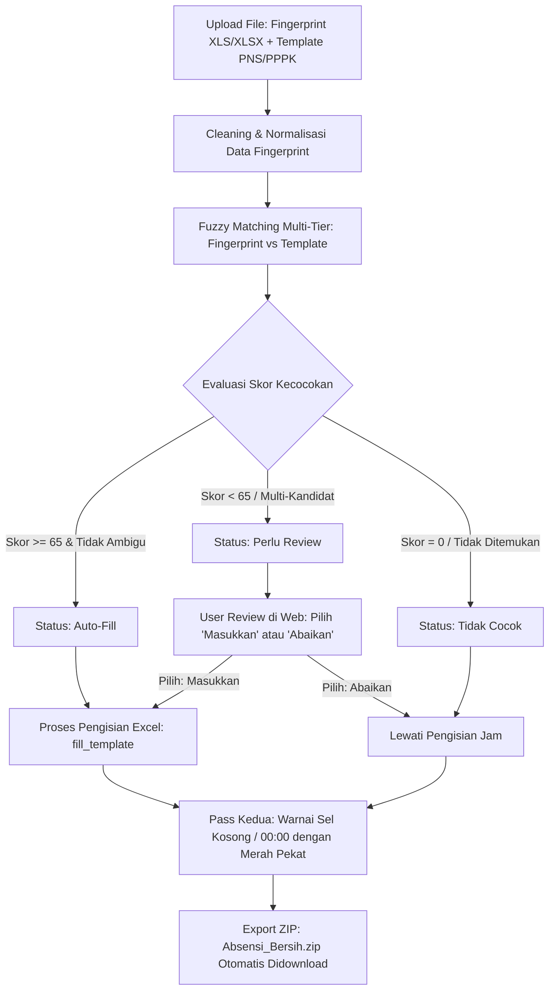

# 📋 ABSENSI CLEANER v2 — Web App Rekapitulasi Absensi Otomatis

Aplikasi web cerdas berbasis **Python (Flask)** yang mengotomatisasi pembersihan (*cleaning*), pencocokan nama (*fuzzy matching*), peninjauan manual interaktif (*review approval*), dan pengisian rekapitulasi data absensi dari mesin fingerprint ke dalam berkas template Excel resmi (**PNS** dan **PPPK**).

---

## 📑 Daftar Isi
1. [Latar Belakang & Tujuan](#-latar-belakang--tujuan)
2. [Struktur Direktori Proyek](#-struktur-direktori-proyek)
3. [Alur Kerja Sistem (Workflow)](#-alur-kerja-sistem-workflow)
4. [Penjelasan Lengkap Fungsi Backend (`app.py`)](#-penjelasan-lengkap-fungsi-backend-apppy)
5. [Daftar Endpoint API (Flask Routes)](#-daftar-endpoint-api-flask-routes)
6. [Fitur Antarmuka Pengguna (`templates/index.html`)](#-fitur-antarmuka-pengguna-templatesindexhtml)
7. [Studi Kasus & Perbaikan Eror (Case Studies)](#-studi-kasus--perbaikan-eror-case-studies)
8. [Panduan Instalasi & Penggunaan](#-panduan-instalasi--penggunaan)

---

## 🎯 Latar Belakang & Tujuan

Sebelum aplikasi ini dibuat, proses rekapitulasi absensi bulanan dilakukan secara manual oleh staf kepegawaian:
- Menelusuri ribuan baris log mentah dari mesin fingerprint per bulan.
- Mencocokkan nama pegawai satu per satu ke dalam file template Excel laporan (PNS dan PPPK).
- Memilah jam masuk dan jam pulang yang valid, menduplikasi jam tap ganda, dan mengisi kolom Masuk (M) dan Pulang (P) untuk tanggal 1 sampai 31.
- Memberi warna merah secara manual pada sel pegawai yang tidak melakukan tap absen.

**Absensi Cleaner v2** memangkas proses manual berjam-jam tersebut menjadi beberapa detik saja dengan tetap memberikan kendali penuh (*human-in-the-loop*) kepada pengguna untuk memvalidasi nama-nama yang ambigu atau memiliki skor kecocokan menengah.

---

## 📁 Struktur Direktori Proyek

```text
absensi_cleaner/
├── app.py                  # Core backend: Flask server, cleaning data, fuzzy matching, & writing Excel
├── JALANKAN.bat            # Script batch Windows: 1-klik untuk start server & auto-buka browser
├── inspect_template.py     # Script diagnostik untuk inspeksi baris & kolom template Excel
├── README.md               # Dokumentasi teknis & panduan lengkap aplikasi
├── static/                 # Aset statis pendukung
├── templates/
│   └── index.html          # Frontend web SPA (Dark mode modern, drag-and-drop, review table)
└── uploads/                # Direktori temporer penyimpanan file unggahan & hasil pemrosesan
```

---

## 🔄 Alur Kerja Sistem (Workflow)



---

## 🧠 Penjelasan Lengkap Fungsi Backend (`app.py`)

Setiap fungsi di dalam `app.py` dibangun secara modular dengan tanggung jawab yang spesifik:

### 1. Fungsi Bantuan Normalisasi & Teks

#### `norm_id(raw)`
- **Fungsi**: Menormalkan ID fingerprint dari mesin absensi.
- **Masalah yang Diatasi**: Excel sering membaca nomor ID numerik sebagai angka desimal bertipe float (contoh: ID `76` terbaca `76.0`).
- **Logika**: Memeriksa apakah string mengandung desimal yang nilainya bulat (`float(s) == int(float(s))`), lalu mengubahnya menjadi integer string (`"76"`).
- **Return**: `str` ID bersih tanpa desimal.

#### `norm_name(name)`
- **Fungsi**: Menormalkan nama pegawai sebelum dilakukan perbandingan string.
- **Logika**:
  1. Mengubah seluruh karakter ke huruf kapital (`upper()`).
  2. Menghapus tanda baca umum seperti titik, koma, tanda hubung, tanda petik, dan kurung (`re.sub(r'[.,\-\'\"()]+', ' ', s)`).
  3. Menghapus spasi ganda menjadi satu spasi tunggal.
- **Return**: `str` nama terstandarisasi.

#### `name_words(name)`
- **Fungsi**: Memecah nama yang sudah dinormalisasi menjadi daftar kata.
- **Logika**: Mengabaikan inisial atau potongan huruf dengan panjang kurang dari 2 karakter.
- **Return**: `list[str]` daftar kata pembentuk nama.

---

### 2. Fungsi Algoritma Pencocokan Nama (*Fuzzy Matching*)

#### `match_score(fp_name, tpl_name)`
- **Fungsi**: Menghitung tingkat kemiripan (skor 0 – 100) dan tipe pencocokan antara nama di mesin fingerprint dengan nama di template Excel.
- **Tingkatan Algoritma**:
  1. **Level 1 — Exact Match (Skor: 100, Tipe: `"exact"`)**: Nama persis sama setelah normalisasi.
  2. **Level 2 — Word Subset / Superset (Skor: 60 – 90, Tipe: `"subset"` / `"superset"`)**: Seluruh kata pada salah satu nama ditemukan lengkap di nama lainnya (berguna jika nama di template menyertakan gelar atau nama keluarga yang tidak ada di fingerprint).
  3. **Level 3 — Partial Word Overlap (Skor: 40 – 80, Tipe: `"partial"`)**: Berbagi kata yang sama dengan panjang minimal 3 karakter (contoh: nama 3 huruf seperti "RIA", "EKO", "TRI").
  4. **Level 4 — Fuzzy Word Matching (Skor: 35 – 75, Tipe: `"fuzzy_words"`)**: Mencocokkan kemiripan kata demi kata dengan batas kemiripan $\ge 0.80$ (menangani kasus typo per kata, misalnya *"mustikah"* vs *"mustika"*).
  5. **Level 5 — Character Similarity / Typo (Skor: 30 – 88, Tipe: `"typo"` / `"similarity"`)**: Menggunakan `difflib.SequenceMatcher` untuk mendeteksi variasi ejaan umum (seperti *"Rijono"* vs *"Riyono"*).
- **Return**: `tuple (score: int, match_type: str)`.

#### `find_best_match(tpl_name, fp_lookup)`
- **Fungsi**: Menemukan kandidat fingerprint terbaik untuk nama pegawai template tertentu dari seluruh lookup fingerprint `fp_lookup = {fp_id: fp_name}`.
- **Aturan Evaluasi**:
  - Mengurutkan semua kandidat berdasarkan skor tertinggi.
  - Jika terdapat **tepat 1 kandidat** dengan skor $\ge 65$ (`AUTO_MATCH_THRESHOLD`): Dikembalikan sebagai `needs_review = False` (Auto-Match).
  - Jika terdapat **lebih dari 1 kandidat** dengan skor $\ge 65$: Terjadi ambiguitas nama, dikembalikan sebagai `needs_review = True`.
  - Jika kandidat terbaik memiliki skor di bawah 65 (namun $> 0$): Dikembalikan sebagai `needs_review = True` (tidak langsung diabaikan, melainkan masuk daftar review pengguna).
  - Jika tidak ada kemiripan sama sekali: Mengembalikan `None, 0, "none", False`.
- **Return**: `tuple (best_id, best_score, best_type, needs_review)`.

---

### 3. Fungsi Ekstraksi & Pembersihan Data Fingerprint

#### `read_fingerprint(filepath)`
- **Fungsi**: Membaca file absensi fingerprint format lama (`.xls` via `xlrd`) maupun modern (`.xlsx` via `openpyxl`).
- **Struktur Kolom**:
  - Kolom 0: `no_id` (ID fingerprint pegawai)
  - Kolom 2: `nama`
  - Kolom 3: `waktu` (string datetime)
  - Kolom 4: `status` (Kolom E pada Excel, misal: `C/Masuk`, `C/Keluar`)
  - Kolom 5: `status_baru` (Kolom F pada Excel, hasil koreksi/lembur)
- **Return**: `list[dict]` baris log mentah.

#### `extract_datetime(waktu_str)`
- **Fungsi**: Mengekstrak nomor hari (tanggal 1–31) dan string jam format `HH:MM` dari string mentah `dd/mm/yyyy HH:MM`.
- **Return**: `tuple (day: int, time_str: str)`.

#### `time_earlier(t1, t2)`
- **Fungsi**: Membandingkan dua string jam `HH:MM`. Mengembalikan `True` jika `t1` lebih awal daripada `t2`.

#### `clean_fingerprint(rows)`
- **Fungsi**: Membersihkan data mentah log fingerprint:
  1. **Resolusi Status Efektif (Case 1)**: Mengutamakan Kolom F (`status_baru`). Jika Kolom F kosong, gunakan Kolom E (`status`).
  2. **Mapping Lembur**: Memetakan `C/Masuk` dan `Lembur Masuk` ke kategori `"masuk"`, serta `C/Keluar` dan `Lembur Keluar` ke kategori `"keluar"`.
  3. **Deduplikasi Jam**: Jika pegawai tap berkali-kali untuk status yang sama dalam satu hari, sistem hanya menyimpan jam yang **paling awal**.
- **Return**:
  - `fp_names`: Dict `{fp_id: canonical_name}`
  - `fp_data`: Dict bersarang `{fp_id: {day: {"masuk": "HH:MM", "keluar": "HH:MM"}}}`

---

### 4. Fungsi Pembacaan & Pengisian Template Excel

#### `read_template_employees(filepath)`
- **Fungsi**: Membaca daftar pegawai di sheet `Input Data Absen` mulai dari baris ke-6 (baris awal data pegawai).
- **Return**: `list[dict]` berisi `row` (nomor baris Excel), `no` (nomor urut), dan `name` (nama pegawai).

#### `time_str_to_dt(time_str)`
- **Fungsi**: Mengonversi format jam string `"07:30"` menjadi objek native Excel `datetime.time(7, 30, 0)`.
- **Return**: `datetime.time` atau `None`.

#### `is_empty_time_cell(value)`
- **Fungsi**: Validasi komprehensif untuk mengecek apakah suatu sel jam kosong.
- **Menangkap**: `None`, angka `0`, float `0.0`, string kosong `""`, dan `datetime.time(0, 0, 0)` (`00:00:00`).
- **Return**: `bool` (`True` jika dianggap kosong).

#### `fill_template(src_path, out_path, matching, fp_data, decisions=None)`
- **Fungsi**: Mengisi file template Excel target dengan log absensi yang valid:
  1. Menyalin berkas asli dengan `shutil.copy2` ke path output agar file asli tidak rusak.
  2. Membuka salinan workbook dengan parameter `keep_vba=(ext == ".xlsm")` untuk melindungi dropdown kolom K dan macro (Case 2).
  3. **Logika Evaluasi Keputusan**:
     - Jika pengguna secara eksplisit memilih `"include"` / `"masukkan"`: Data diisi ke Excel.
     - Jika pengguna secara eksplisit memilih `"ignore"` / `"abaikan"`: Pengisian dilewati.
     - Jika berstatus Auto-Fill (`score >= 65` dan tidak ambigu): Otomatis diisi ke Excel.
     - Jika berstatus review tetapi belum disetujui: Dilewati demi keamanan data.
  4. **Mapping Kolom Tanggal**:
     - Untuk tanggal $d$ (1 sampai 31):
       - Kolom Jam Masuk (**M**) = $3 \times d + 3$
       - Kolom Jam Pulang (**P**) = $3 \times d + 4$
  5. **Pass Kedua — Pewarnaan Sel Kosong (Case 4)**:
     - Seluruh sel jam masuk dan jam pulang yang tidak terisi (bernilai kosong atau `00:00`) pada hari kerja aktif diwarnai merah pekat (`PatternFill(start_color="FFC0392B", fill_type="solid")`).
- **Return**: `int` jumlah sel yang berhasil diisi.

---

## 🌐 Daftar Endpoint API (Flask Routes)

| Metode | Endpoint | Deskripsi |
| :--- | :--- | :--- |
| `GET` | `/` | Merender halaman web utama (`index.html`). |
| `POST` | `/upload-fingerprint` | Menerima berkas log fingerprint, membersihkan data, dan mengembalikan ringkasan statistik (jumlah baris mentah, pegawai, dan record bersih). |
| `POST` | `/upload-template` | Menerima template PNS atau PPPK, membaca daftar pegawai pada sheet `Input Data Absen`. |
| `POST` | `/preview` | Menjalankan algoritma pencocokan nama antara fingerprint dan template, menghasilkan data preview, daftar review, dan data yang tersimpan di sesi. |
| `POST` | `/save-decisions` | Menyimpan keputusan pengguna (`include` / `ignore`) untuk nama berstatus "Perlu Review" ke dalam sesi server. |
| `POST` | `/process` | Memproses pengisian template berdasarkan hasil auto-match dan keputusan review pengguna, membungkus berkas ke dalam `Absensi_Bersih.zip`, dan mengirimkannya untuk diunduh. |
| `POST` | `/debug-matching` | Endpoint diagnostik untuk menginspeksi sampel pembacaan Kolom F (Status Baru) dan detail skor fuzzy matching. |

---

## 💻 Fitur Antarmuka Pengguna (`templates/index.html`)

Antarmuka web dibangun dengan konsep **Single-Page Application (SPA)** bertema modern dark mode yang responsif dan interaktif:

1. **Wizard 3-Langkah Terpadu**:
   - **Langkah 1 (Upload)**: Area *drag-and-drop* untuk 1 file fingerprint dan 2 template (PNS & PPPK). Dilengkapi validasi format dan indikator upload.
   - **Langkah 2 (Preview)**: Ringkasan statistik (Pegawai Fingerprint, Cocok PNS, Cocok PPPK, Perlu Review, Tidak Cocok) serta tab navigasi.
   - **Langkah 3 (Download)**: Area pengunduhan berkas ZIP yang siap pakai dengan indikator proses.
2. **Kontrol Review Interaktif**:
   - **Tombol `✅ Masukkan`**: Tombol bercahaya hijau emerald yang menandai data pegawai review disetujui untuk diisikan ke Excel.
   - **Tombol `❌ Abaikan`**: Tombol bercahaya merah ruby untuk menolak data pegawai review.
   - **Toolbar Massal (*Bulk Action*)**: Tombol `✅ Masukkan Semua` dan `❌ Abaikan Semua` di atas tabel untuk memproses banyak nama review dalam satu klik.
3. **Penyinkronan Real-Time**:
   - Kartu statistik jumlah pegawai yang cocok otomatis bertambah secara dinamis saat tombol review diklik.
   - Banner konfirmasi di bagian download menampilkan kalkulasi jumlah pegawai Auto-Fill + pegawai yang disetujui manual.

---

## 🛠️ Studi Kasus & Perbaikan Eror (Case Studies)

### Case 1 — Prioritas Status Baru (Kolom F) & Pengenalan Lembur
- **Masalah Awal**: Mesin fingerprint sering kali memiliki kolom koreksi manual (Kolom F / `status_baru`) yang menimpa status asli pada Kolom E (`status`). Selain itu, status bertuliskan `Lembur Masuk` atau `Lembur Keluar` tidak dikenali oleh parser standar dan terabaikan.
- **Solusi & Hasil**:
  - Kolom F diutamakan di atas Kolom E (`effective_status = status_baru if status_baru else status`).
  - Dibuat himpunan status case-insensitive: `{"c/masuk", "lembur masuk"}` dikenali sebagai jam Masuk, dan `{"c/keluar", "lembur keluar"}` dikenali sebagai jam Pulang.
  - **Hasil**: 100% jam lembur dan jam koreksi terbaca dengan tepat.

---

### Case 2 — Melindungi Validasi Data Dropdown Kolom K pada Excel
- **Masalah Awal**: Library `openpyxl` secara default dapat menghapus data validation (dropdown keterangan absen seperti Izin, Cuti, Sakit di kolom K) serta macro VBA ketika file `.xlsm`/`.xlsx` disimpan ulang.
- **Solusi & Hasil**:
  - File template asli disalin menggunakan `shutil.copy2` ke lokasi sementara sebelum dimodifikasi.
  - Workbook dimuat dengan `load_workbook(out_path, keep_vba=(ext == ".xlsm"))`.
  - Proses penulisan hanya memodifikasi sel jam Masuk ($3d+3$) dan Pulang ($3d+4$), tanpa menyentuh kolom Keterangan ($3d+5$), rumus formula, atau format sel lainnya.
  - **Hasil**: Dropdown pada kolom K dan formula Excel tetap berfungsi normal.

---

### Case 3 — Deteksi Ambiguitas & Safety Guard pada Pencocokan Nama
- **Masalah Awal**: Beberapa nama memiliki kemiripan tinggi dengan lebih dari satu orang di template, atau nama memiliki gelar/singkatan yang berbeda. Jika sistem memaksakan auto-match, terjadi risiko salah memasukkan absensi ke pegawai yang keliru.
- **Solusi & Hasil**:
  - Diterapkan ambang batas `AUTO_MATCH_THRESHOLD = 65`.
  - Jika terdapat $\ge 2$ kandidat dengan skor tinggi, sistem menandainya sebagai `needs_review = True` (tidak diisi otomatis sebelum disetujui pengguna).
  - **Hasil**: Mencegah salah orang (*false positive*) pada rekapitulasi kehadiran resmi.

---

### Case 4 — Pewarnaan Otomatis Sel Jam Kosong
- **Masalah Awal**: Pegawai yang tidak hadir atau lupa absen menghasilkan sel kosong di Excel. Petugas kepegawaian harus mencari dan mewarnai sel kosong tersebut secara manual. Selain itu, beberapa sel bawaan template berisi nilai default `00:00:00` yang sering lolos dari pemeriksaan nilai kosong standar (`None`).
- **Solusi & Hasil**:
  - Fungsi `is_empty_time_cell` dibangun untuk mendeteksi `None`, `0`, string kosong, dan `time(0, 0, 0)`.
  - Pada pass kedua `fill_template`, seluruh sel jam kosong pada hari kerja yang memiliki data fingerprint otomatis diberi warna merah pekat (`#FFC0392B`).
  - **Hasil**: Seluruh ketidakhadiran langsung teridentifikasi secara visual tanpa perlu koreksi warna manual.

---

### Case 5 — Sistem Interaktif "Perlu Review" dengan Persistensi Export
- **Masalah Awal**: Pada versi sebelumnya, nama yang berada di bawah threshold 65 (seperti *"INDRA PURNOMO KUSUMA HASYIM"*, *"LAMBOK WESLY SIMANGUNSONG"*, *"LUCIA MARTINA DEWI BILLEM"*, *"RIA MUSTIKA D SUNDAYANI"*) otomatis dilewati dan tidak dapat dimasukkan ke Excel tanpa mengubah kode program.
- **Solusi & Hasil**:
  1. Skor di bawah 65 kini tidak dibuang, melainkan ditampilkan sebagai status **"Perlu Review"** lengkap dengan tombol **`✅ Masukkan`** dan **`❌ Abaikan`**.
  2. Keputusan pengguna disimpan di sesi server (`/save-decisions`) dan dikirimkan secara langsung dalam payload saat menekan tombol download (`/process`).
  3. Di dalam `fill_template`, jika pengguna memilih `"include"`, data fingerprint pegawai tersebut langsung diisikan ke Excel. Jika memilih `"ignore"`, data tidak diisi dan sel kosong tetap diwarnai merah.
  4. Auto-Fill dengan skor $\ge 65$ tetap diproses secara otomatis.
  5. Diuji dengan script pengujian otomatis end-to-end (`test_e2e.py`) dan seluruh skenario dinyatakan lulus 100%.

---

## 🚀 Panduan Instalasi & Penggunaan

### Prasyarat Sistem
- **Sistem Operasi**: Windows 10 / 11
- **Python**: Versi 3.10 atau yang lebih baru (disarankan Python 3.13)
- **Library Python**:
  ```bash
  pip install -r requirements.txt
  ```
  *(atau `pip install flask openpyxl xlrd`)*


### Cara Menjalankan Aplikasi

#### A. Pengguna Windows
* Cukup klik dua kali file **`JALANKAN.bat`** (atau jalankan `python jalankan.py`).

#### B. Pengguna Mac (macOS)
* Cukup klik dua kali file **`JALANKAN_MAC.command`** dari Finder (atau ketik `python3 jalankan.py` di Terminal).

> Skrip peluncur akan secara otomatis memeriksa dependensi, mencari port yang bebas (menghindari bentrok AirPlay di Mac), membuka browser default, dan menyalakan aplikasi.

### Langkah Penggunaan di Browser:
1. **Upload**: Drag-and-drop berkas absensi dari mesin fingerprint (`.xls`/`.xlsx`) dan berkas template instansi (`PNS` dan/atau `PPPK`).
2. **Preview**: Klik tombol **"Lihat Preview Matching"**.
3. **Review**:
   - Periksa nama-nama berstatus `⚠️ Perlu Review`.
   - Klik **`✅ Masukkan`** jika nama tersebut sesuai, atau klik **`❌ Abaikan`** jika bukan orang yang bersangkutan.
   - Gunakan tombol **`✅ Masukkan Semua`** / **`❌ Abaikan Semua`** jika ingin memutuskan sekaligus.
4. **Download**: Klik tombol **"⬇️ Download ZIP (PNS + PPPK)"**. Berkas `Absensi_Bersih.zip` akan otomatis terunduh dengan seluruh data yang telah terisi rapi dan sel kosong yang telah diwarnai merah.

---
*Dibuat untuk kebutuhan administrasi kepegawaian magang. Sistem aman, presisi, dan tidak mengubah file template master asli.*
